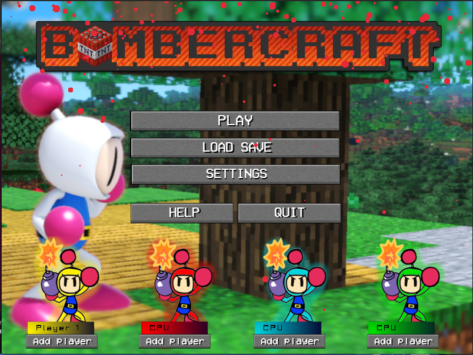
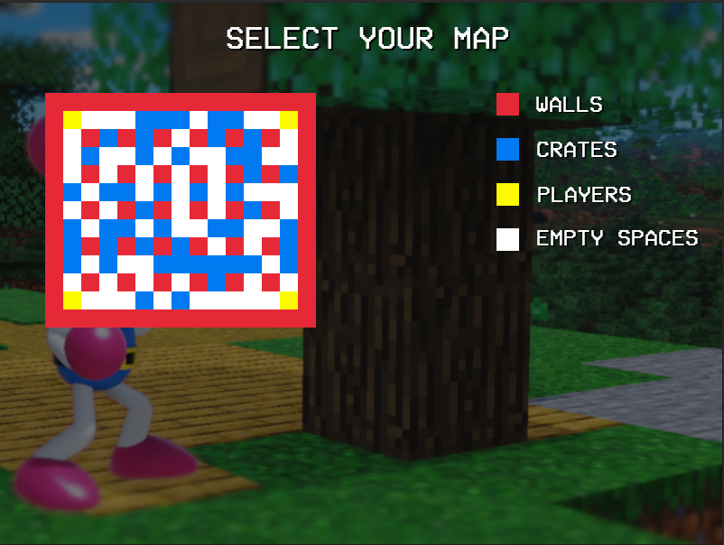
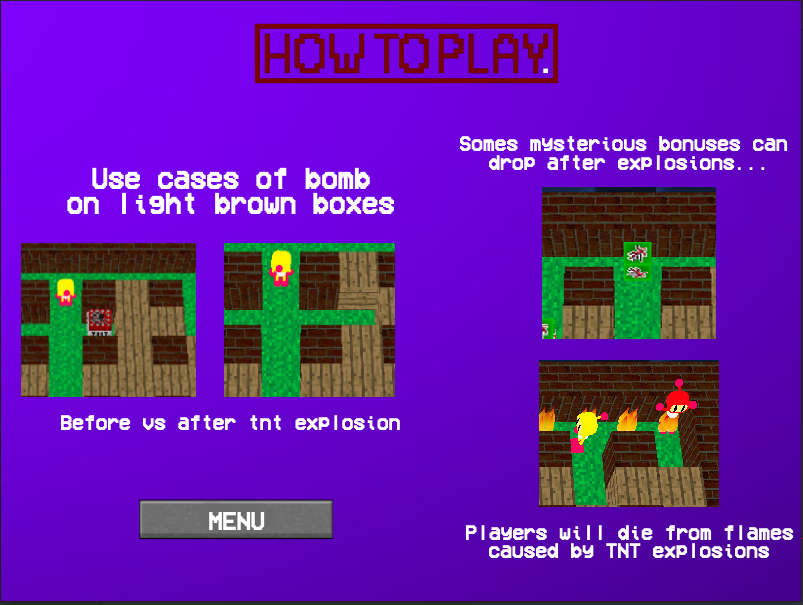
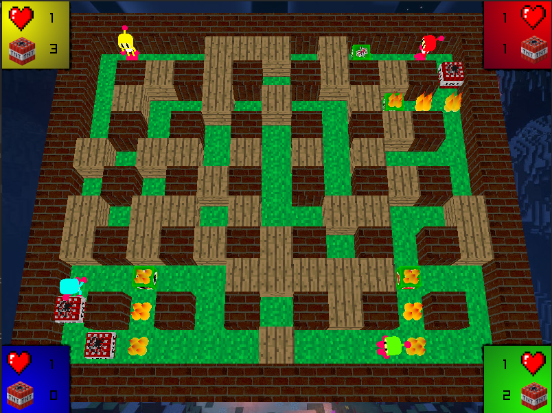
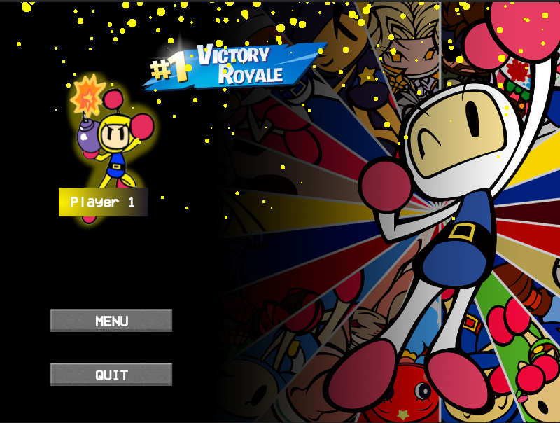

# Bomberman

The aim of the Bomberman is to reproduce the game and to implement a cross-platform 3D video game with real-world tools.

The game allows four players to play at the same time. But we have also integrated AIs that can dodge bombs and try to kill you if there are a missing players.

You also have the possibility to change the basic keys and play with a joystick if you wish.

## Usage

You'll need [make](https://www.gnu.org/software/make/) to compile the project.

```sh
$ git clone https://github.com/Nathn-G/bomberman.git
$ cd arcade
$ mkdir build
$ cd build
$ cmake -DCMAKE_MODULE_PATH="$PWD/../cmake" ..
$ make
$ ./bomberman
```

## Views

</a>
</a>
</a>
</a>
</a>

## Credits

**Nathan Guiu**  https://github.com/Nathn-G</br>
**Mathis Lorenzo**  https://github.com/mathis-lorenzo</br>
**Antonin Ricard**  https://github.com/antonin-11</br>
**Hugo Rodrigues**  https://github.com/hugomagics</br>
**Thomy Lorenzatti**  https://github.com/ThomyLorenzatti</br>
**Théo Bori**  https://github.com/theobori